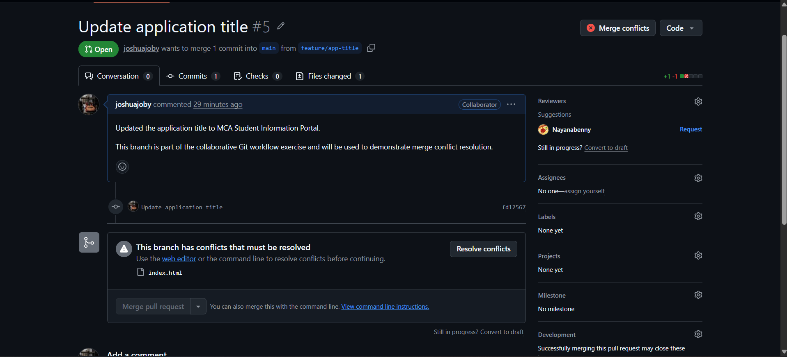
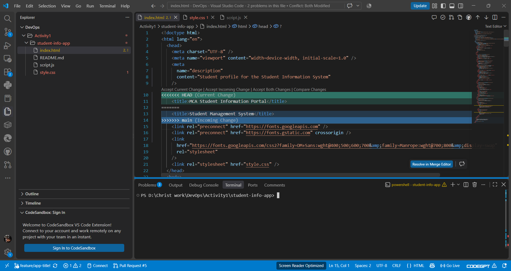
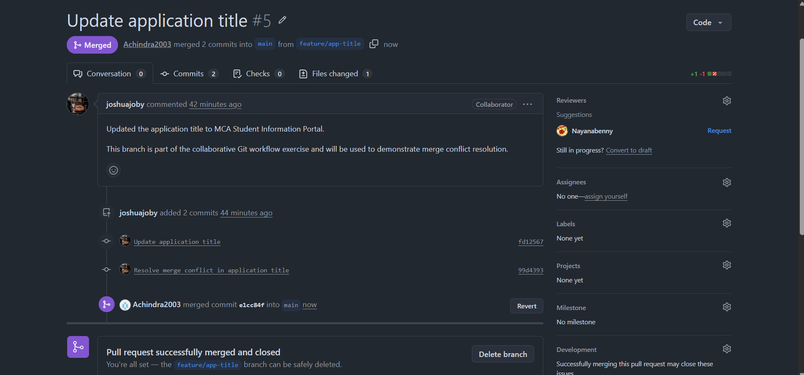

# Student Information System

## Team Members
- Achindra - Team Lead / Developer
- Nayana Benny - UI Developer
- Joshua Joby - JavaScript Developer

## Project Description
A simple Student Information Web App built to practice a collaborative Git workflow (branching, pull requests, and merge conflict resolution).

## Technologies Used
- HTML
- CSS
- JavaScript

## Git Branching Strategy
- `main` - stable, deployable branch
- `feature/ui` - UI improvements
- `feature/javascript` - JavaScript functionality
- `feature/contact` - contact information section
- `feature/nayana` - heading update
- `feature/app-title` - title update

All feature branches were merged into `main` via Pull Requests after review.

## Pull Requests Created
- feature/ui -> main
- feature/javascript -> main
- feature/contact -> main
- feature/nayana -> main
- feature/app-title -> main

## Merge Conflict
**What caused the conflict?**
`feature/nayana` and `feature/app-title` were both created from the same version of `main` and both modified the same `<title>` line in `index.html` with different text.

**How was it resolved?**
After merging `main` into `feature/app-title`, the conflict markers were reviewed and the two changes were combined into a single title, then committed and pushed.

## How to Run the Application
1. Clone the repository.
2. Open `index.html` in a web browser.
